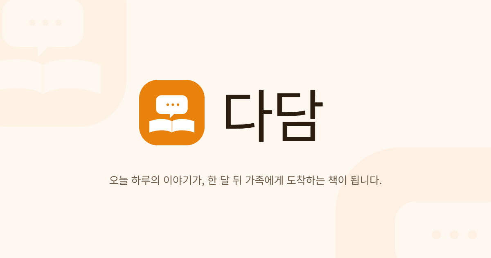

<div align="center">

# 다담 (DaDam)

### 어르신이 매달 책을 쓰고, 가족은 그 책을 기다립니다

AI 말동무와의 일상 대화가 어르신의 **월간 책**이 되고,
가족은 그 책을 읽고 챕터마다 댓글로 이어가는 **"한 집안의 출판 플랫폼"**

[](https://dadam.chat/)
&nbsp;




</div>

---

## 프로젝트 소개

대한민국은 2025년 **초고령사회**(65세 이상 20% 이상)에 진입했고, **1인 고령가구**가 빠르게 늘고 있습니다.
고령층의 **사회적 고립·고독사·인지 저하**는 가족과의 단절에서 비롯되지만, 기존 시니어 케어 서비스는 대부분
**감시·모니터링** 중심이라 어르신을 "보호 대상"으로만 다룹니다.

**다담**은 어르신을 **저자(Author)** 로 세웁니다.

- **어르신** — 매일 AI 말동무와 대화를 나눕니다. 타이핑 대신 음성으로.
- **AI** — 대화를 기억하고 먼저 말을 건네는 **고스트라이터(Ghostwriter)**. 한 달치 대화를 모아 책 초안을 씁니다.
- **가족** — 어르신 1명에 N명이 연결된 **독자(Reader)**. 새 책이 나오면 알림을 받고, 챕터마다 댓글을 남깁니다.
  가족의 댓글은 다음 달 책의 새 재료가 됩니다.

매일의 대화가 쌓여 한 달의 책이 되고, 1년 뒤에는 가족 모두가 함께 쓴 한 권의 자서전이 완성됩니다.

> **기업** 오브젠 · **트랙** AI/빅데이터 · **기간** 2026.04.10 ~ 2026.06.16 (9주)

---

## 핵심 기능

### 1. AI 말동무 실시간 음성 대화

- **음성 입출력** — `gpt-realtime-whisper` STT + Naver Clova Voice Premium TTS. 네트워크·브라우저 제약 시 Web Speech API로 자동 폴백
- **선제 대화** — 누적된 관심사 메모리를 근거로 AI가 먼저 질문을 던집니다 ("지난주에 토마토 수확하셨다고 했죠?")
- **관심사 메모리 RAG** — 세션이 끝나면 LLM이 대화에서 관심사를 추출해 `memories` JSONB에 누적, 다음 대화의 문맥으로 사용
- **발화 태그 분류** — 각 발화에 주제 태그를 자동 부여해 월말 책 생성의 재료로 정리

### 2. 월말 책 자동 생성

- **3단계 파이프라인** — `aggregating`(한 달치 대화 수집) → `chaptering`(챕터 구성·집필) → `cover`(표지 생성)
- **AI 표지** — DALL-E 3로 표지 후보 3~5장을 생성해 `book-covers` 버킷에 저장
- **실패 복구** — `retry_count` 기반 자동 3회 재시도 + 수동 재시도 RPC
- **배치 트리거** — pg_cron이 매월 말일에 생성 Edge Function을 호출

### 3. 어르신 책 편집 & 출간

- **"한 번에 하나" UX** — 챕터 빼기, 제목 바꾸기를 음성·큰 버튼으로. 시니어 인지 부하를 낮춘 단계형 편집
- **표지 선택 + 헌사/에필로그** 입력 후 출간 승인 → 가족 책장에 게시되고 전원에게 알림 발송

### 4. 가족 책장 & 커뮤니티

- **책꽂이 메타포** — 아날로그 책장 UI, 책 넘김 애니메이션, 월별 아카이브
- **챕터 댓글 (Realtime)** — Supabase Realtime 구독으로 가족 전체에게 실시간 반영
- **어르신 음성 답장** — 댓글에 음성으로 답장, signed URL로 재생
- **실시간 알림 UI** — 신간·댓글 알림 구독 및 읽음 처리

### 5. Whisper 파인튜닝 검증 *(포트폴리오 트랙)*

한국어 시니어 음성에 대한 STT 정확도를 직접 검증했습니다. `whisper/compare_with_whisper1.ipynb`의 3-way 비교 결과,
**turbo 순정 모델의 CER 6.44%** 가 LoRA 파인튜닝(9.72%)과 OpenAI `whisper-1`(9.60%)을 모두 능가 →
**실서비스는 순정 모델 사용**으로 결정했습니다.

<details>
<summary>전체 기능 목록 (F-01 ~ F-18)</summary>

| # | 기능 | 분류 | 담당 | 브랜치 |
|---|------|------|------|--------|
| F-01 | 백엔드 기반 세팅 (테이블·RLS·Storage·pg_cron·Realtime) | 인프라 | 권오인 | `feature/backend-foundation` |
| F-02 | 카카오 OAuth 인증 + 프로필 자동 생성 트리거 | 인증 | 권오인 | `feature/auth` |
| F-03 | AI 말동무 실시간 음성 대화 | AI/음성 | 권오인 | `feature/voice-chat` |
| F-04 | 관심사 메모리 추출 & 누적 | AI | 권오인 | `feature/memory-system` |
| F-05 | AI 선제 대화 & 발화 태그 분류 | AI | 권오인 | `feature/proactive-chat` |
| F-06 | 월말 책 초안 자동 생성 | 책 생성 | 권오인 | `feature/book-generation` |
| F-07 | AI 표지 이미지 생성 (DALL-E 3) | 책 생성 | 권오인 | `feature/cover-generation` |
| F-08 | 책 생성 실패 복구 | 안정성 | 권오인 | `feature/book-retry` |
| F-09 | Whisper 파인튜닝 검증 (포트폴리오용) | AI/음성 | 권오인 | `feature/whisper-finetune` |
| F-10 | 프론트엔드 기반 세팅 (Vite·Tailwind·shadcn·PWA·시니어 테마) | 인프라 | 이지형 | `feature/frontend-foundation` |
| F-11 | 가족 1:N 초대 | 가족 커뮤니티 | 이지형 | `feature/family-invite` |
| F-12 | 어르신 책 편집 UI | 책 편집 | 이지형 | `feature/book-edit` |
| F-13 | 표지 선택 & 출간 승인 | 책 편집 | 이지형 | `feature/book-publish` |
| F-14 | 가족 책장 UI | 가족 커뮤니티 | 이지형 | `feature/family-bookshelf` |
| F-15 | 챕터 댓글 (Realtime) | 가족 커뮤니티 | 이지형 | `feature/comments` |
| F-16 | 어르신 음성 답장 | 가족 커뮤니티 | 이지형 | `feature/voice-reply` |
| F-17 | 실시간 알림 UI | 알림 | 이지형 | `feature/notifications-ui` |
| F-18 | 외전(단편) 책 자동 생성 | 책 생성 | 권오인 | `feature/short-book` |

</details>

---

## 기술 스택

| 영역 | 사용 기술 |
|------|-----------|
| **Frontend** | React 19, Vite 8, TypeScript, React Router v7, Tailwind CSS v4, shadcn/ui v4 |
| **상태 관리** | Zustand (전역), TanStack Query v5 (서버 상태) |
| **PWA** | Vite PWA Plugin (설치형 웹앱, 오프라인 셸) |
| **Backend** | Supabase — Auth · Postgres · Realtime · Storage · Edge Functions (별도 서버 없음) |
| **AI 프록시** | Supabase Edge Functions + Vercel AI SDK (모델 추상화 레이어) |
| **LLM** | GPT-4o / GPT-4o-mini (상용), Gemini 1.5 Flash (개발·테스트) |
| **음성 STT** | OpenAI `gpt-realtime-whisper` (`stt-whisper` Edge Function) · Web Speech API 폴백 |
| **음성 TTS** | Naver Clova Voice Premium (`tts-clova` Edge Function, `ngoeun` + 속도 3단계) · SpeechSynthesis 폴백 |
| **이미지 생성** | DALL-E 3 (책 표지 후보) |
| **배치** | pg_cron + Scheduled Edge Functions (월말 책 초안 생성) |
| **인증** | 카카오 OAuth 2.0 |
| **배포** | Vercel (프론트엔드) · Supabase (백엔드) |

상세 버전·의존성은 [`docs/dev/tech-stack.md`](./docs/dev/tech-stack.md) 참조.

---

## 아키텍처

Supabase BaaS 위에 올린 서버리스 구조입니다. 클라이언트는 **anon 키 + RLS로만** 접근하며 `service_role` 키는 사용하지 않습니다.

```
frontend/ (React PWA)          ← Vercel 배포, anon key + RLS
      │  supabase-js
      ▼
Supabase (BaaS)
      ├─ Auth ......... 카카오 OAuth
      ├─ Postgres ..... RLS · RPC 10개 · 트리거 · pg_cron
      ├─ Realtime ..... notifications / comments / replies (3채널)
      ├─ Storage ...... avatars / book-covers / reply-audio (3버킷)
      └─ Edge Functions (Deno, 11개)
             voice-chat · extract-memory · tag-utterances
             generate-book · generate-cover · retry-book-job
             stt-whisper · tts-clova · send-push
             discover-short-book-topics · delete-account
      │
      ▼
외부 AI API                     ← OpenAI (LLM · STT · DALL-E 3) · Naver Clova Voice
```

- **백엔드 코드 = DB(마이그레이션·RLS·RPC) + Edge Function.** 별도 애플리케이션 서버가 없습니다.
- 각 기능은 `feature/*` 브랜치로 나뉘며, 담당자가 프론트 + Edge Function + RLS + 마이그레이션을 **수직 슬라이스**로 구현합니다.

경계면(타입·RPC·Realtime·Storage) 계약은 [`docs/work/api-spec.md`](./docs/work/api-spec.md)가 정본입니다.

---

## 저장소 구조

```
Dadam/
├── frontend/              # React 19 + Vite 8 + TS + Tailwind v4 (PWA)
│   ├── src/
│   │   ├── features/      #   기능 단위 (F 번호 기준 분리)
│   │   ├── routes/        #   라우팅 (React Router v7)
│   │   ├── shared/        #   공용 컴포넌트·훅·유틸
│   │   └── lib/           #   Supabase 클라이언트 등 외부 연동
│   └── public/
├── supabase/
│   ├── functions/         # Edge Function 11개 (Deno)
│   └── migrations/        # 테이블 + RLS + 트리거 + Storage 버킷
├── whisper/               # F-09 Whisper 파인튜닝·평가 노트북 (CER 비교)
├── prompt/                # LLM 프롬프트 실험 노트북 + few-shot 예제
├── docs/
│   ├── dev/               # PRD · FRD · ERD · tech-stack · datasets
│   └── work/              # 역할분담 · 코드컨벤션 · API 명세 · git 워크플로
└── CLAUDE.md              # AI 에이전트 작업 가이드 (문서 인덱스)
```

---

## 로컬 실행

> 모든 프론트엔드 명령은 `frontend/` 디렉터리에서 실행합니다.

### 사전 요구사항

- **Node.js 24** (개발 기준 v24.13.1), npm 11+ — [`docs/dev/tech-stack.md`](./docs/dev/tech-stack.md) 참조
- Supabase 프로젝트 (URL + anon 키)
- 카카오 개발자 앱 (JavaScript 키)

### 프론트엔드

```bash
cd frontend
cp .env.example .env          # 아래 값 채우기
npm install --legacy-peer-deps
npm run dev                   # http://localhost:5173
```

`.env` 주요 항목 (값은 각자 발급):

| 변수 | 용도 |
|------|------|
| `VITE_SUPABASE_URL` | Supabase 프로젝트 URL |
| `VITE_SUPABASE_ANON_KEY` | Supabase anon 키 |
| `VITE_KAKAO_JS_KEY` | 카카오 로그인 JavaScript 키 |
| `VITE_APP_URL` | 앱 기본 URL (OAuth 리다이렉트·공유 링크) |
| `VITE_VAPID_PUBLIC_KEY` | 웹 푸시 VAPID 공개 키 |
| `VITE_TTS_DISABLED` | (선택) 개발 중 TTS 호출 차단 플래그 |

### 백엔드 (Supabase)

```bash
supabase db push                              # 마이그레이션 적용
supabase functions serve                      # Edge Function 로컬 실행
supabase functions deploy <function-name>     # 개별 배포
```

Edge Function 환경 변수는 [`supabase/functions/.env.example`](./supabase/functions/.env.example) 참조 (OpenAI · Naver Clova 키 등).

### 자주 쓰는 스크립트

| 명령 | 용도 |
|------|------|
| `npm run dev` | 개발 서버 (Vite HMR) |
| `npm run build` | `tsc -b` 타입 체크 + 프로덕션 빌드 |
| `npm run lint` | ESLint |
| `npm run preview` | 빌드 결과 로컬 프리뷰 |
| `npm test` | Vitest 1회 실행 |
| `npm run test:watch` | Vitest watch 모드 |

---

## 배포

| 대상 | 방식 |
|------|------|
| **프론트엔드** | Vercel — 루트 [`vercel.json`](./vercel.json) 사용. `buildCommand`: `cd frontend && npm run build`, `outputDirectory`: `frontend/dist`, SPA rewrite 설정. `frontend/` 변경분이 없으면 빌드 스킵 |
| **백엔드** | Supabase — `supabase db push` (스키마) + `supabase functions deploy` (Edge Function) |

배포 서비스: **<https://dadam.chat/>**

---

## 팀

| 담당 | 역할 |
|------|------|
| **권오인** | 백엔드 인프라 · AI/LLM 파이프라인 · Edge Function · 음성(STT/TTS) · Whisper 파인튜닝 |
| **이지형** | 시니어 UI/UX · 책장 메타포 · 가족 커뮤니티 · Realtime 구독 · PWA |

2인 / 9주 (2026.04.10 ~ 2026.06.16) / 오브젠 · AI·빅데이터 트랙

---

## 문서 맵

정본(source of truth)은 아래 문서이며, `CLAUDE.md`는 인덱스 역할만 합니다.

### 기획 · 설계 — [`docs/dev/`](./docs/dev/)

| 문서 | 내용 |
|------|------|
| [PRD.md](./docs/dev/PRD.md) | 제품 요구사항 (기능 F-01~F-18 정의) |
| [FRD.md](./docs/dev/FRD.md) | 기능 상세 스펙 |
| [erd.md](./docs/dev/erd.md) | 데이터 모델 · RLS · Enum (DB 스키마 정본) |
| [tech-stack.md](./docs/dev/tech-stack.md) | 기술 스택 상세 |
| [datasets.md](./docs/dev/datasets.md) | 데이터셋 정리 |

### 협업 · 운영 — [`docs/work/`](./docs/work/)

| 문서 | 내용 |
|------|------|
| [role-assignment.md](./docs/work/role-assignment.md) | 역할 분담 · 브랜치 · 인터페이스 계약 · 오너십 |
| [code-convention.md](./docs/work/code-convention.md) | 코드 스타일 · 네이밍 · 주석 규약 |
| [api-spec.md](./docs/work/api-spec.md) | RPC · Realtime · Storage · Edge Function 호출 규약 |
| [git-workflow.md](./docs/work/git-workflow.md) | 브랜치 · 커밋 · PR · 리뷰 규칙 |
| [budget.md](./docs/work/budget.md) | 예산 |
