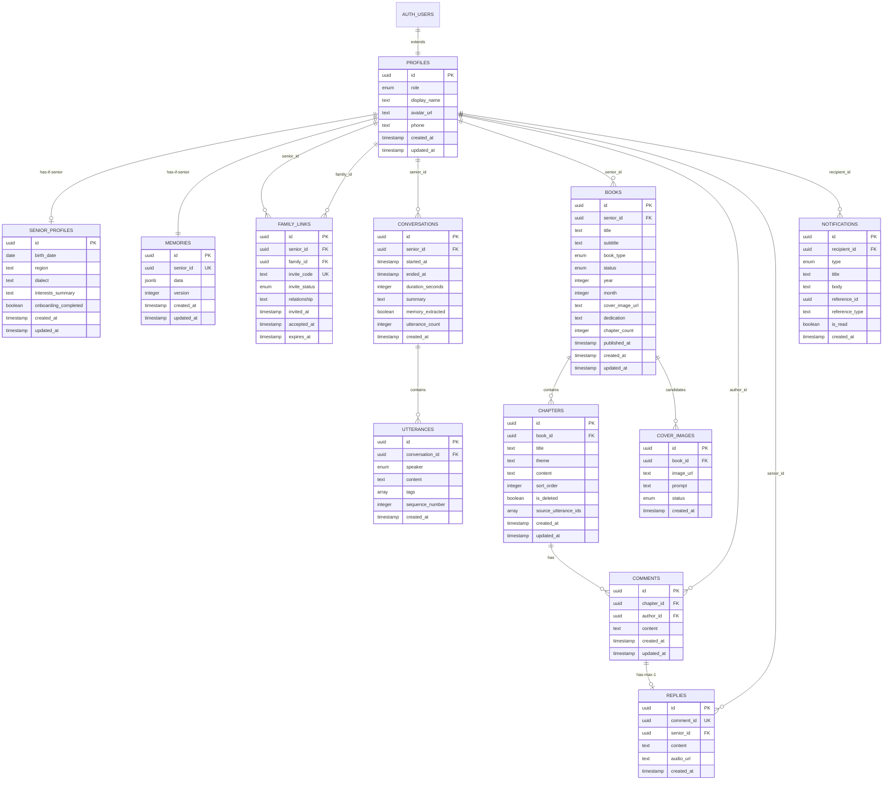

# ERD: 시니어 가족 출판 플랫폼 데이터 모델

> **문서 버전**: v1.0
> **작성일**: 2026-04-16
> **관련 PRD**: v2.2 §7 데이터 모델 개요 / §9.2 Q7 확정
> **DB**: PostgreSQL (Supabase)

---

## 1. ERD 다이어그램



---

## 2. Enum 타입 정의

```sql
-- 사용자 역할 구분
CREATE TYPE user_role AS ENUM ('senior', 'family');

-- 가족 초대 상태
CREATE TYPE invite_status AS ENUM ('pending', 'accepted', 'expired', 'revoked');

-- 책 생명주기
CREATE TYPE book_status AS ENUM ('draft', 'editing', 'published');

-- 책 유형: 월간 정기 / 주제 단편 조기 출간
CREATE TYPE book_type AS ENUM ('monthly', 'short');

-- 발화 태그 분류 (AI 자동 태깅)
CREATE TYPE utterance_tag AS ENUM (
  'daily_mundane',       -- 일상 잡담 (책 제외 후보)
  'memory_recall',       -- 추억 회상
  'emotional_peak',      -- 감정 고조
  'philosophy',          -- 가치관/철학
  'relationship_event'   -- 관계 사건
);

-- 알림 유형
CREATE TYPE notification_type AS ENUM (
  'new_book',            -- 신간 출간
  'new_comment',         -- 새 댓글
  'new_reply',           -- 어르신 답글
  'invite_accepted',     -- 가족 초대 수락
  'book_draft_ready'     -- 책 초안 생성 완료
);

-- 표지 이미지 선택 상태
CREATE TYPE cover_status AS ENUM ('candidate', 'selected', 'rejected');

-- 대화 화자 구분
CREATE TYPE speaker_role AS ENUM ('senior', 'ai');
```

---

## 3. 테이블 정의서

### 3.1 `profiles` — 공통 사용자 프로필

> Supabase `auth.users`를 확장하는 공개 프로필 테이블. PK가 auth.users.id와 동일.

| 컬럼 | 타입 | 제약조건 | 설명 |
|------|------|---------|------|
| `id` | UUID | PK, FK → auth.users(id) ON DELETE CASCADE | Supabase Auth 사용자 ID |
| `role` | user_role | NOT NULL | 어르신 / 가족 구분 |
| `display_name` | TEXT | NOT NULL | 표시 이름 |
| `avatar_url` | TEXT | NULL | 프로필 이미지 URL (Supabase Storage) |
| `phone` | TEXT | NULL | 연락처 |
| `created_at` | TIMESTAMPTZ | NOT NULL, DEFAULT now() | 생성일 |
| `updated_at` | TIMESTAMPTZ | NOT NULL, DEFAULT now() | 수정일 |

---

### 3.2 `senior_profiles` — 어르신 상세 프로필

> profiles에서 role='senior'인 사용자의 추가 정보. 1:1 관계.

| 컬럼 | 타입 | 제약조건 | 설명 |
|------|------|---------|------|
| `id` | UUID | PK, FK → profiles(id) ON DELETE CASCADE | profiles.id와 동일 |
| `birth_date` | DATE | NULL | 생년월일 |
| `region` | TEXT | NULL | 거주 지역 (예: '경상남도 진주시') |
| `dialect` | TEXT | NULL | 사투리 (예: '경상도') — Whisper/AI 대화 스타일 참고용 |
| `interests_summary` | TEXT | NULL | 사람이 읽을 수 있는 관심사 요약 (UI 표시용) |
| `onboarding_completed` | BOOLEAN | NOT NULL, DEFAULT false | 초기 설정 완료 여부 |
| `created_at` | TIMESTAMPTZ | NOT NULL, DEFAULT now() | 생성일 |
| `updated_at` | TIMESTAMPTZ | NOT NULL, DEFAULT now() | 수정일 |

---

### 3.3 `family_links` — 어르신-가족 연결 + 초대

> 초대와 연결을 하나의 테이블에서 관리. 초대 대기 시 family_id = NULL.

| 컬럼 | 타입 | 제약조건 | 설명 |
|------|------|---------|------|
| `id` | UUID | PK, DEFAULT gen_random_uuid() | |
| `senior_id` | UUID | NOT NULL, FK → profiles(id) ON DELETE CASCADE | 어르신 |
| `family_id` | UUID | NULL, FK → profiles(id) ON DELETE CASCADE | 가족 (수락 전 NULL) |
| `invite_code` | TEXT | NOT NULL, UNIQUE | 초대 코드/링크 토큰 |
| `invite_status` | invite_status | NOT NULL, DEFAULT 'pending' | 초대 상태 |
| `relationship` | TEXT | NULL | 관계 (예: '장남', '손녀', '며느리') |
| `invited_at` | TIMESTAMPTZ | NOT NULL, DEFAULT now() | 초대 생성 시점 |
| `accepted_at` | TIMESTAMPTZ | NULL | 수락 시점 |
| `expires_at` | TIMESTAMPTZ | NOT NULL | 초대 만료 시점 |

**제약조건:**
- `UNIQUE(senior_id, family_id) WHERE family_id IS NOT NULL` — 동일 어르신-가족 중복 연결 방지

---

### 3.4 `memories` — 관심사 메모리 (JSONB)

> 어르신 1명당 1행. AI가 대화에서 추출한 관심사를 자유 형식 JSONB로 저장.

| 컬럼 | 타입 | 제약조건 | 설명 |
|------|------|---------|------|
| `id` | UUID | PK, DEFAULT gen_random_uuid() | |
| `senior_id` | UUID | NOT NULL, UNIQUE, FK → profiles(id) ON DELETE CASCADE | 어르신 (1:1) |
| `data` | JSONB | NOT NULL, DEFAULT '{}'::jsonb | 관심사 데이터 |
| `version` | INTEGER | NOT NULL, DEFAULT 1 | 낙관적 동시성 제어용 버전 |
| `created_at` | TIMESTAMPTZ | NOT NULL, DEFAULT now() | 생성일 |
| `updated_at` | TIMESTAMPTZ | NOT NULL, DEFAULT now() | 수정일 |

**JSONB `data` 예시 구조** (스키마 강제 아님, AI가 자유롭게 확장):

```jsonc
{
  "hobbies": ["텃밭 가꾸기", "화투", "트로트 듣기"],
  "relationships": {
    "민준": { "relation": "손자", "mentions": 12, "last_mentioned": "2026-04-10" },
    "영희": { "relation": "이웃", "mentions": 5, "last_mentioned": "2026-04-08" }
  },
  "health": ["무릎 안 좋음", "당뇨 관리 중"],
  "philosophy": ["자식은 멀리 보내야 한다", "아침밥은 꼭 먹어야"],
  "recurring_topics": ["텃밭 토마토", "옛날 고향 이야기"],
  "scheduled_events": [
    { "event": "병원 정기검진", "date": "2026-04-20" }
  ],
  "emotional_patterns": {
    "happy_topics": ["손주 이야기", "텃밭"],
    "sensitive_topics": ["남편 기일"]
  }
}
```

**설계 근거:** AI가 대화에서 자유롭게 태그를 생성해야 하고, MVP 단계에서 카테고리 구조가 자주 변경되므로 정규화 테이블 대신 JSONB 채택. GIN 인덱스로 쿼리 성능 확보.

---

### 3.5 `conversations` — 대화 세션

> 어르신과 AI의 대화 세션 메타데이터. 출간 후 1년 삭제 대상.

| 컬럼 | 타입 | 제약조건 | 설명 |
|------|------|---------|------|
| `id` | UUID | PK, DEFAULT gen_random_uuid() | |
| `senior_id` | UUID | NOT NULL, FK → profiles(id) ON DELETE CASCADE | 어르신 |
| `started_at` | TIMESTAMPTZ | NOT NULL, DEFAULT now() | 대화 시작 |
| `ended_at` | TIMESTAMPTZ | NULL | 대화 종료 |
| `duration_seconds` | INTEGER | NULL | 대화 시간 (초) |
| `summary` | TEXT | NULL | AI 생성 세션 요약 |
| `memory_extracted` | BOOLEAN | NOT NULL, DEFAULT false | 메모리 추출 완료 여부 |
| `utterance_count` | INTEGER | NOT NULL, DEFAULT 0 | 발화 수 |
| `created_at` | TIMESTAMPTZ | NOT NULL, DEFAULT now() | 레코드 생성일 |

**보관 정책:** 관련 책의 `published_at`으로부터 1년 후 스케줄 작업으로 삭제. utterances는 CASCADE로 함께 삭제.

---

### 3.6 `utterances` — 발화 단위

> 대화 내 개별 발화(어르신/AI). 자동 태그 포함. conversations와 함께 삭제.

| 컬럼 | 타입 | 제약조건 | 설명 |
|------|------|---------|------|
| `id` | UUID | PK, DEFAULT gen_random_uuid() | |
| `conversation_id` | UUID | NOT NULL, FK → conversations(id) ON DELETE CASCADE | 소속 대화 세션 |
| `speaker` | speaker_role | NOT NULL | 화자 (senior / ai) |
| `content` | TEXT | NOT NULL | 발화 내용 |
| `tags` | utterance_tag[] | NOT NULL, DEFAULT '{}' | 자동 분류 태그 (복수 가능) |
| `sequence_number` | INTEGER | NOT NULL | 대화 내 순서 |
| `created_at` | TIMESTAMPTZ | NOT NULL, DEFAULT now() | 생성일 |

**`tags` 설명:** PostgreSQL 배열 타입. 하나의 발화에 여러 태그 부여 가능 (예: `{memory_recall, emotional_peak}`).

---

### 3.7 `books` — 월간/단편 책

> 어르신의 월간 책 또는 조기 출간 단편. 생명주기: draft → editing → published.

| 컬럼 | 타입 | 제약조건 | 설명 |
|------|------|---------|------|
| `id` | UUID | PK, DEFAULT gen_random_uuid() | |
| `senior_id` | UUID | NOT NULL, FK → profiles(id) ON DELETE CASCADE | 저자(어르신) |
| `title` | TEXT | NOT NULL | 책 제목 |
| `subtitle` | TEXT | NULL | 부제 |
| `book_type` | book_type | NOT NULL, DEFAULT 'monthly' | 월간 / 단편 |
| `status` | book_status | NOT NULL, DEFAULT 'draft' | 생명주기 상태 |
| `year` | INTEGER | NOT NULL | 출간 연도 |
| `month` | INTEGER | NOT NULL | 출간 월 |
| `cover_image_url` | TEXT | NULL | 선택된 최종 표지 URL (Supabase Storage) |
| `dedication` | TEXT | NULL | 헌사/에필로그 (선택) |
| `chapter_count` | INTEGER | NOT NULL, DEFAULT 0 | 챕터 수 |
| `published_at` | TIMESTAMPTZ | NULL | 출간일 (status → published 시 설정) |
| `created_at` | TIMESTAMPTZ | NOT NULL, DEFAULT now() | 생성일 |
| `updated_at` | TIMESTAMPTZ | NOT NULL, DEFAULT now() | 수정일 |

**제약조건:**
- `UNIQUE(senior_id, year, month) WHERE book_type = 'monthly'` — 월간 책 중복 방지

---

### 3.8 `chapters` — 주제 기반 챕터

> 책 내 챕터. 주제별 그룹핑 (시간순 아님). 소프트 삭제 지원.

| 컬럼 | 타입 | 제약조건 | 설명 |
|------|------|---------|------|
| `id` | UUID | PK, DEFAULT gen_random_uuid() | |
| `book_id` | UUID | NOT NULL, FK → books(id) ON DELETE CASCADE | 소속 책 |
| `title` | TEXT | NOT NULL | 챕터 제목 (어르신이 변경 가능) |
| `theme` | TEXT | NOT NULL | 주제 (예: '가족', '추억', '일상', '가치관') |
| `content` | TEXT | NOT NULL | 서사 본문 (AI 생성) |
| `sort_order` | INTEGER | NOT NULL, DEFAULT 0 | 표시 순서 |
| `is_deleted` | BOOLEAN | NOT NULL, DEFAULT false | 소프트 삭제 (되돌리기 가능) |
| `source_utterance_ids` | UUID[] | NULL | 원본 발화 ID 목록 (FK 아님 — 대화 삭제 후에도 챕터 유지) |
| `created_at` | TIMESTAMPTZ | NOT NULL, DEFAULT now() | 생성일 |
| `updated_at` | TIMESTAMPTZ | NOT NULL, DEFAULT now() | 수정일 |

**설계 근거:**
- `is_deleted`: PRD "Error Recovery > Prevention" 원칙에 따라 소프트 삭제. 어르신이 되돌리기 가능.
- `source_utterance_ids`: FK가 아닌 단순 UUID 배열. 대화 원문은 1년 후 삭제되지만 챕터는 영구 보존해야 하므로 의도적 분리.

---

### 3.9 `comments` — 가족 댓글

> 가족이 챕터에 남기는 댓글. 모든 가족에게 공개.

| 컬럼 | 타입 | 제약조건 | 설명 |
|------|------|---------|------|
| `id` | UUID | PK, DEFAULT gen_random_uuid() | |
| `chapter_id` | UUID | NOT NULL, FK → chapters(id) ON DELETE CASCADE | 대상 챕터 |
| `author_id` | UUID | NOT NULL, FK → profiles(id) ON DELETE CASCADE | 작성자 (가족) |
| `content` | TEXT | NOT NULL | 댓글 내용 |
| `created_at` | TIMESTAMPTZ | NOT NULL, DEFAULT now() | 생성일 |
| `updated_at` | TIMESTAMPTZ | NOT NULL, DEFAULT now() | 수정일 |

---

### 3.10 `replies` — 어르신 답글

> 가족 댓글에 대한 어르신의 음성 답글. 댓글 1개당 답글 1개 (UNIQUE).

| 컬럼 | 타입 | 제약조건 | 설명 |
|------|------|---------|------|
| `id` | UUID | PK, DEFAULT gen_random_uuid() | |
| `comment_id` | UUID | NOT NULL, UNIQUE, FK → comments(id) ON DELETE CASCADE | 대상 댓글 (1:1) |
| `senior_id` | UUID | NOT NULL, FK → profiles(id) ON DELETE CASCADE | 작성자 (어르신) |
| `content` | TEXT | NOT NULL | 음성 → 텍스트 변환된 답글 내용 |
| `audio_url` | TEXT | NULL | 원본 음성 파일 URL (Supabase Storage, 선택) |
| `created_at` | TIMESTAMPTZ | NOT NULL, DEFAULT now() | 생성일 |

**제약조건:** `UNIQUE(comment_id)` — 댓글당 어르신 답글 1개만 허용. 시니어 UX "한 번에 하나" 원칙.

---

### 3.11 `cover_images` — 표지 이미지 후보

> DALL-E 3로 생성된 표지 후보. 책당 3~5개.

| 컬럼 | 타입 | 제약조건 | 설명 |
|------|------|---------|------|
| `id` | UUID | PK, DEFAULT gen_random_uuid() | |
| `book_id` | UUID | NOT NULL, FK → books(id) ON DELETE CASCADE | 대상 책 |
| `image_url` | TEXT | NOT NULL | Supabase Storage URL |
| `prompt` | TEXT | NULL | DALL-E에 사용된 프롬프트 |
| `status` | cover_status | NOT NULL, DEFAULT 'candidate' | 선택 상태 |
| `created_at` | TIMESTAMPTZ | NOT NULL, DEFAULT now() | 생성일 |

---

### 3.12 `notifications` — 알림

> 다형성 참조(polymorphic)로 모든 알림 유형을 단일 테이블에서 관리. Supabase Realtime 구독 대상.

| 컬럼 | 타입 | 제약조건 | 설명 |
|------|------|---------|------|
| `id` | UUID | PK, DEFAULT gen_random_uuid() | |
| `recipient_id` | UUID | NOT NULL, FK → profiles(id) ON DELETE CASCADE | 수신자 |
| `type` | notification_type | NOT NULL | 알림 유형 |
| `title` | TEXT | NOT NULL | 알림 제목 |
| `body` | TEXT | NULL | 알림 본문 |
| `reference_id` | UUID | NULL | 참조 대상 ID (책/댓글/답글 등) |
| `reference_type` | TEXT | NULL | 참조 대상 유형 ('book', 'comment', 'reply', 'family_link') |
| `is_read` | BOOLEAN | NOT NULL, DEFAULT false | 읽음 여부 |
| `created_at` | TIMESTAMPTZ | NOT NULL, DEFAULT now() | 생성일 |

**설계 근거:** `reference_id` + `reference_type` 다형성 패턴 채택. 알림 유형이 늘어나도 테이블 변경 없이 확장 가능.

---

### 3.13 Phase 2 Placeholder

> MVP에는 포함되지 않음. 향후 고도화 시 상세 설계 예정.

```sql
-- Phase 2: 가족 하이라이트 (문장 밑줄/주석)
-- highlights (id, chapter_id, family_id, start_offset, end_offset, note, created_at)

-- Phase 2: 합본 (6개월/1년 단위 재편성)
-- compilations (id, senior_id, title, period_start, period_end, source_book_ids, status, created_at)
```

---

## 4. 관계 매핑

```
auth.users     1 ── 1  profiles
profiles       1 ── 1  senior_profiles        (role='senior'인 경우)
profiles       1 ── 1  memories               (role='senior'인 경우)
profiles(senior) 1 ── N  family_links          (senior_id)
profiles(family) 1 ── N  family_links          (family_id)
profiles       1 ── N  conversations          (senior_id)
profiles       1 ── N  books                  (senior_id)
profiles       1 ── N  comments               (author_id, 가족)
profiles       1 ── N  replies                (senior_id)
profiles       1 ── N  notifications          (recipient_id)

conversations  1 ── N  utterances
books          1 ── N  chapters
books          1 ── N  cover_images
chapters       1 ── N  comments
comments       1 ── 1  replies                (UNIQUE comment_id)
```

---

## 5. 인덱스 설계

```sql
-- profiles: 역할별 조회
CREATE INDEX idx_profiles_role ON profiles(role);

-- family_links: 어르신의 가족 목록 조회 (수락된 것만)
CREATE INDEX idx_family_links_senior_accepted
  ON family_links(senior_id) WHERE invite_status = 'accepted';

-- family_links: 가족이 연결된 어르신 조회
CREATE INDEX idx_family_links_family_accepted
  ON family_links(family_id) WHERE invite_status = 'accepted';

-- family_links: 초대 코드 검색 (대기 중인 것만)
CREATE INDEX idx_family_links_invite_code_pending
  ON family_links(invite_code) WHERE invite_status = 'pending';

-- conversations: 어르신의 대화 목록 (최신순)
CREATE INDEX idx_conversations_senior_started
  ON conversations(senior_id, started_at DESC);

-- conversations: 대화 삭제 배치 작업용
CREATE INDEX idx_conversations_senior_created
  ON conversations(senior_id, created_at);

-- utterances: 대화 내 발화 순서대로 조회
CREATE INDEX idx_utterances_conversation_seq
  ON utterances(conversation_id, sequence_number);

-- utterances: 태그 기반 검색 (책 생성 시 태그별 발화 선별)
CREATE INDEX idx_utterances_tags
  ON utterances USING GIN(tags);

-- books: 어르신의 책 목록 (상태별)
CREATE INDEX idx_books_senior_status
  ON books(senior_id, status);

-- books: 연/월 기준 조회
CREATE INDEX idx_books_senior_year_month
  ON books(senior_id, year, month);

-- books: 대화 정리 배치 작업용 (출간일 기준)
CREATE INDEX idx_books_published_at
  ON books(published_at) WHERE published_at IS NOT NULL;

-- chapters: 책 내 챕터 순서 (삭제되지 않은 것만)
CREATE INDEX idx_chapters_book_order
  ON chapters(book_id, sort_order) WHERE is_deleted = false;

-- comments: 챕터의 댓글 목록 (시간순)
CREATE INDEX idx_comments_chapter_created
  ON comments(chapter_id, created_at);

-- replies: 댓글의 답글 조회
CREATE INDEX idx_replies_comment
  ON replies(comment_id);

-- notifications: 읽지 않은 알림 (최신순)
CREATE INDEX idx_notifications_recipient_unread
  ON notifications(recipient_id, created_at DESC) WHERE is_read = false;

-- memories: JSONB 내부 검색용 GIN 인덱스
CREATE INDEX idx_memories_data
  ON memories USING GIN(data);
```

---

## 6. RLS (Row Level Security) 정책

### 6.1 헬퍼 함수

```sql
-- 현재 인증 사용자의 역할 조회
CREATE OR REPLACE FUNCTION public.get_user_role()
RETURNS user_role AS $$
  SELECT role FROM profiles WHERE id = auth.uid()
$$ LANGUAGE sql SECURITY DEFINER STABLE;

-- 현재 사용자가 특정 어르신의 가족인지 확인
CREATE OR REPLACE FUNCTION public.is_family_of(p_senior_id UUID)
RETURNS BOOLEAN AS $$
  SELECT EXISTS (
    SELECT 1 FROM family_links
    WHERE senior_id = p_senior_id
      AND family_id = auth.uid()
      AND invite_status = 'accepted'
  )
$$ LANGUAGE sql SECURITY DEFINER STABLE;
```

### 6.2 정책 스케치

#### `profiles` — 본인 프로필 + 연결된 가족/어르신 프로필 조회

```sql
-- 본인: 전체 접근
CREATE POLICY "own_profile" ON profiles
  FOR ALL USING (id = auth.uid());

-- 가족이 연결된 어르신 프로필 조회
CREATE POLICY "family_reads_senior" ON profiles
  FOR SELECT USING (
    EXISTS (
      SELECT 1 FROM family_links
      WHERE senior_id = profiles.id
        AND family_id = auth.uid()
        AND invite_status = 'accepted'
    )
  );
```

#### `conversations` / `utterances` — 어르신 본인만 접근

```sql
-- 대화 원문: 어르신만 (PRD §5.1 핵심 보안 요구사항)
CREATE POLICY "senior_own_conversations" ON conversations
  FOR ALL USING (senior_id = auth.uid());

CREATE POLICY "senior_own_utterances" ON utterances
  FOR ALL USING (
    conversation_id IN (
      SELECT id FROM conversations WHERE senior_id = auth.uid()
    )
  );
```

#### `memories` — 어르신 본인만

```sql
CREATE POLICY "senior_own_memory" ON memories
  FOR ALL USING (senior_id = auth.uid());
```

#### `books` — 어르신 전체 접근 / 가족은 출간본만

```sql
-- 어르신: 자신의 모든 책
CREATE POLICY "senior_own_books" ON books
  FOR ALL USING (senior_id = auth.uid());

-- 가족: 출간된 책만 읽기
CREATE POLICY "family_reads_published" ON books
  FOR SELECT USING (
    status = 'published' AND is_family_of(senior_id)
  );
```

#### `chapters` — 책 접근 권한 상속

```sql
-- 어르신: 자신의 모든 챕터
CREATE POLICY "senior_own_chapters" ON chapters
  FOR ALL USING (
    book_id IN (SELECT id FROM books WHERE senior_id = auth.uid())
  );

-- 가족: 출간 책의 삭제되지 않은 챕터만
CREATE POLICY "family_reads_published_chapters" ON chapters
  FOR SELECT USING (
    is_deleted = false
    AND book_id IN (
      SELECT id FROM books
      WHERE status = 'published' AND is_family_of(senior_id)
    )
  );
```

#### `comments` — 가족 작성 + 가족/어르신 전체 공개

```sql
-- 본인 댓글: 전체 접근
CREATE POLICY "own_comments" ON comments
  FOR ALL USING (author_id = auth.uid());

-- 가족: 연결된 어르신 책의 모든 댓글 읽기
CREATE POLICY "family_reads_comments" ON comments
  FOR SELECT USING (
    chapter_id IN (
      SELECT c.id FROM chapters c
      JOIN books b ON c.book_id = b.id
      WHERE b.status = 'published' AND is_family_of(b.senior_id)
    )
  );

-- 어르신: 자신의 책 댓글 읽기
CREATE POLICY "senior_reads_comments" ON comments
  FOR SELECT USING (
    chapter_id IN (
      SELECT c.id FROM chapters c
      JOIN books b ON c.book_id = b.id
      WHERE b.senior_id = auth.uid()
    )
  );
```

#### `replies` — 어르신 작성 + 가족/어르신 전체 공개

```sql
-- 어르신: 자신의 답글 관리
CREATE POLICY "senior_manages_replies" ON replies
  FOR ALL USING (senior_id = auth.uid());

-- 가족: 연결된 어르신의 답글 읽기
CREATE POLICY "family_reads_replies" ON replies
  FOR SELECT USING (
    comment_id IN (
      SELECT cm.id FROM comments cm
      JOIN chapters ch ON cm.chapter_id = ch.id
      JOIN books b ON ch.book_id = b.id
      WHERE b.status = 'published' AND is_family_of(b.senior_id)
    )
  );
```

#### `notifications` — 본인만

```sql
CREATE POLICY "own_notifications" ON notifications
  FOR ALL USING (recipient_id = auth.uid());
```

> **참고:** 월말 책 생성, 메모리 추출 등 Edge Functions 배치 작업은 `service_role` 키를 사용하여 RLS를 우회합니다.

---

## 7. 트리거 및 자동화 함수

### 7.1 `updated_at` 자동 갱신

```sql
-- updated_at 컬럼을 자동으로 현재 시각으로 갱신하는 트리거 함수
CREATE OR REPLACE FUNCTION update_updated_at()
RETURNS TRIGGER AS $$
BEGIN
  NEW.updated_at = now();
  RETURN NEW;
END;
$$ LANGUAGE plpgsql;

-- 적용 대상 테이블
CREATE TRIGGER set_updated_at BEFORE UPDATE ON profiles
  FOR EACH ROW EXECUTE FUNCTION update_updated_at();
CREATE TRIGGER set_updated_at BEFORE UPDATE ON senior_profiles
  FOR EACH ROW EXECUTE FUNCTION update_updated_at();
CREATE TRIGGER set_updated_at BEFORE UPDATE ON memories
  FOR EACH ROW EXECUTE FUNCTION update_updated_at();
CREATE TRIGGER set_updated_at BEFORE UPDATE ON books
  FOR EACH ROW EXECUTE FUNCTION update_updated_at();
CREATE TRIGGER set_updated_at BEFORE UPDATE ON chapters
  FOR EACH ROW EXECUTE FUNCTION update_updated_at();
CREATE TRIGGER set_updated_at BEFORE UPDATE ON comments
  FOR EACH ROW EXECUTE FUNCTION update_updated_at();
```

### 7.2 신규 사용자 자동 프로필 생성

```sql
-- auth.users에 새 사용자가 생성되면 profiles + (어르신인 경우) senior_profiles, memories 자동 생성
CREATE OR REPLACE FUNCTION handle_new_user()
RETURNS TRIGGER AS $$
BEGIN
  -- 공통 프로필 생성
  INSERT INTO public.profiles (id, role, display_name)
  VALUES (
    NEW.id,
    COALESCE(NEW.raw_user_meta_data->>'role', 'family')::user_role,
    COALESCE(NEW.raw_user_meta_data->>'display_name', '사용자')
  );

  -- 어르신인 경우 추가 테이블 생성
  IF COALESCE(NEW.raw_user_meta_data->>'role', 'family') = 'senior' THEN
    INSERT INTO public.senior_profiles (id) VALUES (NEW.id);
    INSERT INTO public.memories (senior_id) VALUES (NEW.id);
  END IF;

  RETURN NEW;
END;
$$ LANGUAGE plpgsql SECURITY DEFINER;

-- auth.users INSERT 시 자동 실행
CREATE TRIGGER on_auth_user_created
  AFTER INSERT ON auth.users
  FOR EACH ROW EXECUTE FUNCTION handle_new_user();
```

---

## 8. 라이프사이클

### 8.1 가족 초대 흐름

```
1. 어르신(또는 도와주는 가족)이 초대 생성
   → family_links INSERT: senior_id 설정, family_id = NULL, invite_status = 'pending'
   → invite_code 생성, expires_at = now() + 7일

2. 초대 코드/링크 공유 (메시지, QR 등)

3. 가족이 가입 또는 로그인 후 초대 코드 입력
   → invite_code 검증, 만료 확인
   → family_links UPDATE: family_id = auth.uid(), invite_status = 'accepted', accepted_at = now()

4. 어르신에게 알림 발송
   → notifications INSERT: type = 'invite_accepted'
```

### 8.2 책 생성 파이프라인

```
1. 월말 스케줄 작업 (pg_cron / Scheduled Edge Function)
   → 해당 월 대화에서 발화 수집
   → 태그 기반 필터링 (daily_mundane 비중 낮은 것 우선)
   → 빈도/감정 강도/서사성 가중치로 상위 10~20% 선별

2. 주제별 챕터 구성
   → 가족/추억/일상/가치관 등 테마 그룹핑
   → LLM으로 서사 생성
   → books INSERT: status = 'draft'
   → chapters INSERT: 3~5개 챕터

3. 표지 후보 생성
   → DALL-E 3로 3~5개 이미지 생성
   → cover_images INSERT: status = 'candidate'
   → Supabase Storage에 이미지 저장

4. 어르신 알림
   → notifications INSERT: type = 'book_draft_ready'

5. 어르신 편집
   → 챕터 빼기: chapters UPDATE SET is_deleted = true
   → 제목 바꾸기: chapters UPDATE SET title = '새 제목'
   → 표지 선택: cover_images UPDATE SET status = 'selected'
   → books UPDATE SET cover_image_url = 선택된 이미지 URL

6. 출간 승인
   → books UPDATE SET status = 'published', published_at = now()
   → 모든 연결 가족에게 알림
   → notifications INSERT: type = 'new_book' (가족 수만큼)
```

### 8.3 대화 원문 정리 (1년 보관 정책)

```sql
-- 스케줄 작업: 출간 후 1년 지난 책에 해당하는 대화 삭제
-- utterances는 conversations ON DELETE CASCADE로 자동 삭제
DELETE FROM conversations c
WHERE c.senior_id IN (
  SELECT b.senior_id FROM books b
  WHERE b.status = 'published'
    AND b.published_at < now() - INTERVAL '1 year'
    AND b.year = EXTRACT(YEAR FROM c.started_at)
    AND b.month = EXTRACT(MONTH FROM c.started_at)
);
```

---

## 9. 주요 설계 결정 및 근거

| # | 결정 | 근거 |
|---|------|------|
| 1 | **Memory를 JSONB로 저장** | AI가 대화에서 자유 형식 태그를 추출하므로 미리 정의된 카테고리 테이블보다 유연. MVP 단계에서 구조 변경이 잦음. GIN 인덱스로 쿼리 성능 확보 가능 |
| 2 | **대화 원문 1년 후 삭제** | 스토리지 비용 절감 + 개인정보 리스크 감소. 추출된 관심사(memories)와 생성된 책(books/chapters)은 영구 보존 |
| 3 | **챕터 소프트 삭제** | PRD "Error Recovery > Prevention" 원칙. 어르신이 실수로 삭제한 챕터를 되돌릴 수 있어야 함 |
| 4 | **source_utterance_ids를 FK 없이 UUID 배열로** | 대화는 1년 후 삭제되지만 챕터는 영구 보존. FK를 걸면 대화 삭제 시 CASCADE로 챕터도 사라짐 |
| 5 | **답글 1:1 (UNIQUE comment_id)** | 시니어 UX "한 번에 하나" 원칙. 복잡한 스레드 대화보다 단순한 응답 구조가 적합 |
| 6 | **알림 DB 저장 + Realtime** | 읽지 않은 알림 목록과 이력 조회가 필요. Realtime만으로는 오프라인 시 알림 유실 |
| 7 | **family_links가 초대 + 연결 겸임** | 별도 invitations 테이블 없이 하나의 테이블에서 초대 → 수락 흐름 관리. family_id NULL 여부로 상태 구분 |
| 8 | **다형성 알림 (reference_id + reference_type)** | 알림 유형별 nullable FK를 여러 개 두는 것보다 확장성 좋음. 새 알림 유형 추가 시 테이블 변경 불필요 |
